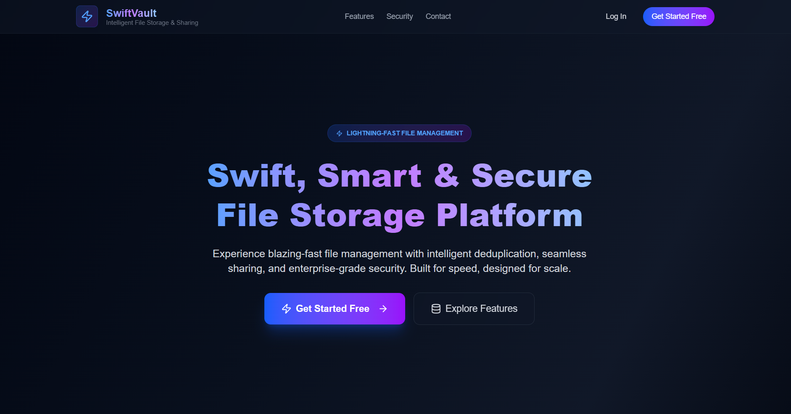
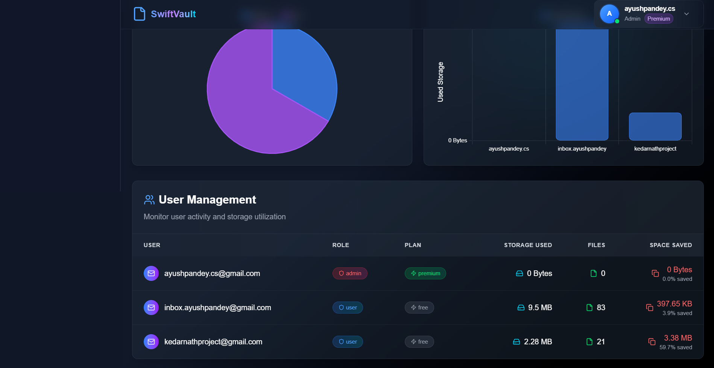
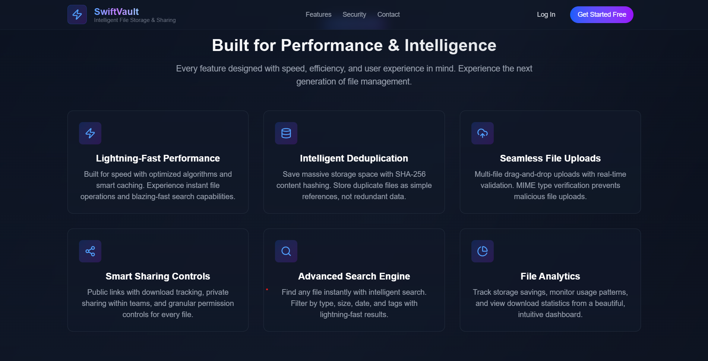
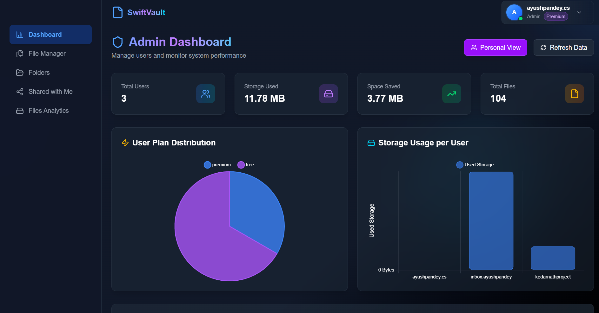
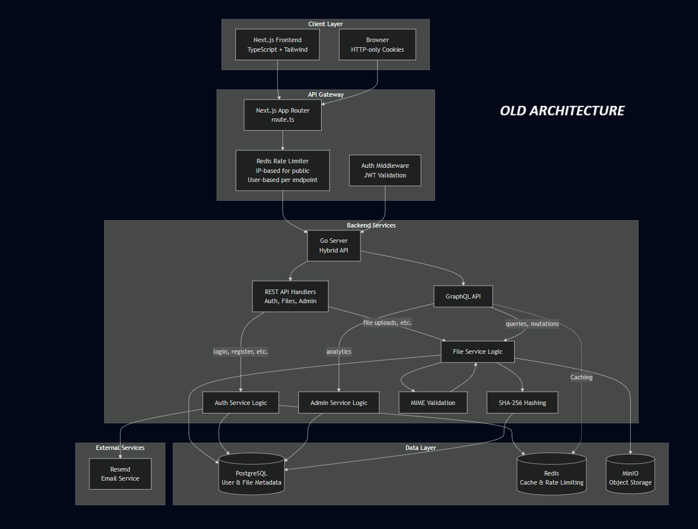
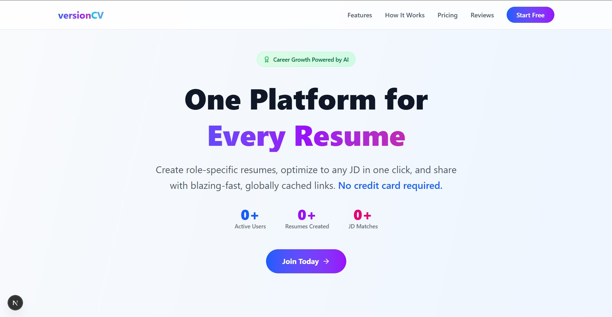
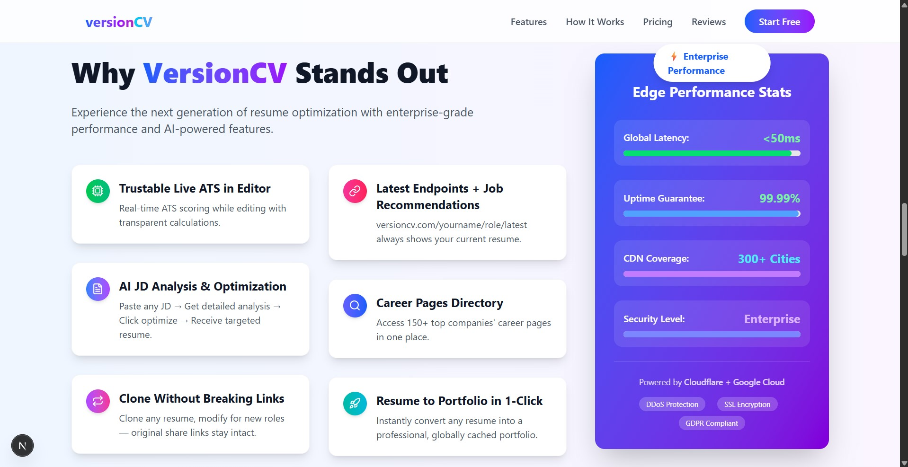
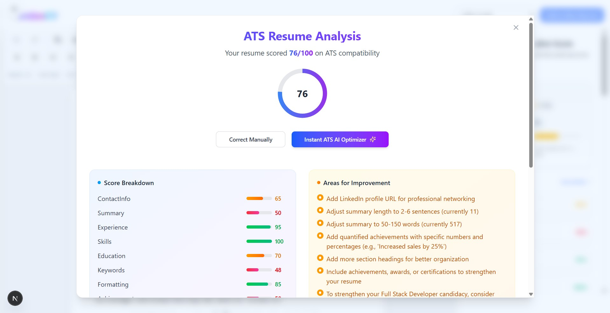
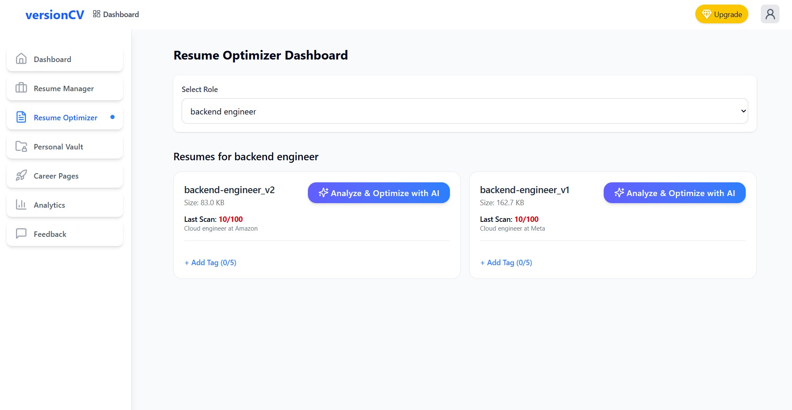
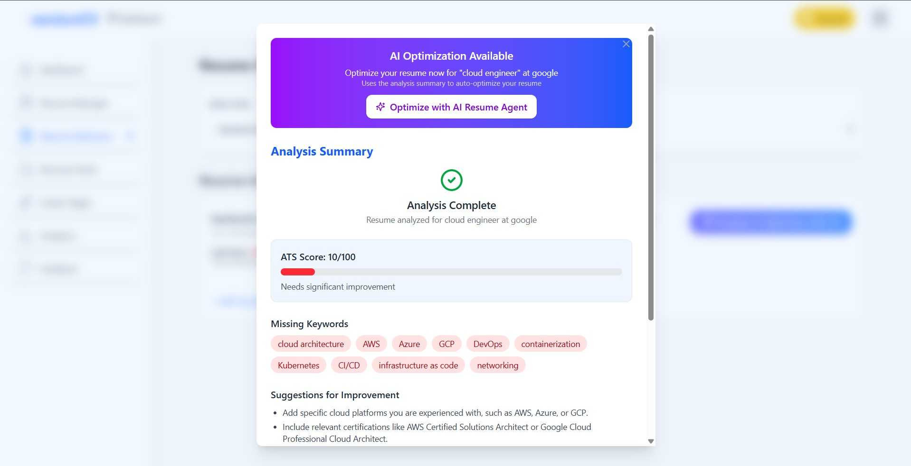

<h2 align="center">Cloud-Native | Edge-Native | Scalable Architectures | High-Performance APIs</h2>

<h3 align="center">Optimizing Cloud Costs | Scaling Systems Efficiently | Security First Mindset</h3>

<a href="https://drive.google.com/file/d/1nRxbqq2rBkVTs5oPBvM_qmwUIpfMsyMz/view?usp=drive_link">
<strong>📜 View Latest Resume</strong>
</a>

---

## 🔍 About Me
### 💭 Execution is the currency that converts ideas into value.

### 🏆 Led a 3-member team to 2nd Place (out of 800) at Google DSC IIT Kanpur’s ‘The Return Journey’ Hackathon (2024).

### 💡 Passionate** about problem-solving, scalable cloud architectures, and serverless microservices.

### 🔥 Focused** on high-performance APIs, cloud automation, and cost-effective infrastructure solutions.

### ⚡ Constantly learning** and implementing efficient, scalable, and production-grade systems.

---

## 📊 GitHub Stats

---

## 💻 Tech Stack

### Programming Languages

### Web & Frameworks

### Cloud Platforms

### DevOps & Deployment

### Databases & Storage

### APIs & Tools

### Architecture & Concepts

### Computer Science Fundamentals

---

## 🚀 Featured Production Grade Projects

### 🔒 SwiftVault - Enterprise File Vault System **🌐 Live at:** [swiftvault](https://swiftvault.versioncv.com)

**📅 Timeline:** 8 Days 
🏁 Built for BalkanID 80 LPA Full-Time Hiring Challenge (September 2025)
(In 6 Days as Solo Developer -> Ideation + Architecture + Coding + Testing + Cloud Deployment + Extras -> 2 Days Edge Native - Serverless Optimization)

#### 🎯 The Challenge
Built a production-grade secure file vault with intelligent deduplication, custom JWt implementation with token generation, claim-based access control, token verification, refresh token, advanced sharing, and comprehensive analytics in just **6 days** - then revolutionized its architecture in **2 more days** to achieve near-zero costs.

  

#### ⚡ The Transformation: From $17/month to $0/month

<b>📊 Architecture Evolution</b>

#### **Before: Monolithic Architecture** 💰 $17/month ($204/year)

**Pain Points:** Idle costs, single point of failure, regional deployment

#### **After: Distributed Serverless Architecture** 🎉 $0/month (Year 1)

**Benefits:** Zero idle costs, global distribution, pay-per-use, independent scaling

#### 🎯 Key Achievements

- **💰 Cost Optimization:** Reduced from **$204/year → $0** (Year 1), **$108/year** (Year 2+) = **47% permanent savings**
- **⚡ Performance:** <100ms metadata, <500ms uploads with edge caching
- **🔒 Security:** RS256 JWT, bcrypt hashing, MIME validation, SHA-256 deduplication
- **📊 Efficiency:** 30-40% storage savings through intelligent deduplication
- **🌍 Global:** Distributed edge architecture with <50ms response times
- **📈 Scale:** Designed to handle 10K+ req/sec with zero-cost scaling

#### 🛠️ Tech Stack

**Backend:** Go, GraphQL, PostgreSQL, Redis, MinIO
**Frontend:** Next.js 14, TypeScript, Tailwind CSS
**Cloud:** AWS (t2.micro), Vercel, Cloudflare Workers/KV/R2, Neon PostgreSQL
**DevOps:** Docker, Nginx, SSL/TLS, GitHub Actions

#### ✨ Standout Features

- 🧠 **Intelligent Deduplication:** SHA-256 hash-based duplicate detection
- 🔐 **Zero-Client Architecture:** All client side sent data are cross-verified before use.
- ⚡ **Real-time Processing:** Async uploads with live progress tracking
- 🎯 **Advanced Search:** Multi-criteria filtering with tag support
- 📊 **Admin Analytics:** Comprehensive system monitoring
- 🔗 **Flexible Sharing:** Private user sharing + public link sharing
- 🚀 **Rate Limiting:** Redis-based throttling (2 req/s user, 10 req/s IP)

#### 🎓 Key Learnings

✅ Monoliths are expensive for unpredictable traffic
✅ Serverless architecture enables true pay-as-you-go economics
✅ Edge-native is the future: low latency + zero idle costs
✅ Free tiers are powerful when architected correctly 

---

### 🎯 VersionCV - AI-Powered Resume Optimization Platform (Beta Launched) **🌐 Live at:** [www.versioncv.com](https://www.versioncv.com)

**👨‍💻 Role:** Founder & Solo Developer
**🏛️ Registered:** MSME – Govt of India
**📅 Timeline:** June 2025 – Present

#### 🎯 Vision
Transforming how professionals manage and optimize their resumes with AI driven resume rewriting, ATS optimization, JD Matching, version control, personal vaults, resume to portfolio.

#### ✨ Core Features

- 🤖 **AI Resume Optimization Agent**
  - Gemini, Chatgpt, claude, mistral used in fallback manner
  - Job-specific structured prompts
  - Section-wise ATS optimization
  - Can rewrite whole resume under 30 seconds.
  - Preserved Links original data accuracy.
  - Hallucination Control using algorithmic prompt.
  - Token Optimization for cost and ratelimits.
    

- 📊 **Instant ATS Analyzer**
  - Real-time scoring and feedback
  - Keyword optimization suggestions
  - Format compatibility checking
  - ATS parsability detection
  - Complex layout, missing section, word density etc. detection correction.

- 📊 **Custom VersionCV Editor (zero dependency)**
  - React Powered  WYSIWYG Editor with ATS Scanner Integrated.

- 🗂️ **Smart Resume Management**
  - Role-based version control
  - Shareable, CDN-accessible links
  - Cloudflare R2 storage with versioning
  - Clone and edit.
  - Can do resume correction even after link submission replace original at same link.
  - Track Analytics for each of the resume file, role, vault.

- 🔐 **Enterprise Security**
  - Firebase JWT authentication on each request. (1ms full claims verification)
  - Email verification.
  - Zero Client Trust model.
  - Main DB and buckets accessible only by internal api( no dns ) accessible through rpc calls only.
  - API interlocking using different secrets for each and are present only on the cloudflare secret manager.
  - Multiple layer of DDOS mitigation strategy, Cloudflare, internal Rate Limiter with 4 fallbacks.
    

#### 🏗️ Technical Architecture

**Architecture:** Fully decoupled, edge-native serverless, multi-cloud microservices
**Deployment:** Google Cloud Run, Vercel Edge, Cloudflare Workers, D1/R2/Queue/KV Cache/Durable Objects/Cloudflare CDN
**Performance:** <100ms latency, 10K+ req/sec capability, 99.9% uptime
**Security:** DDoS protection, bot verification, Firebase JWT auth, API interlocking using internal secrets, Ratelimiter with 4 layered fallback mechanism

#### 💾 Data Strategy

- **Primary DB:** Cloudflare D1 (SQLite) with fallback protection
- **Caching:** KV Cache Cloudflare CDN with real-time invalidation (>99% hit rate)
- **Storage:** Cloudflare R2 for CDN-accessible, versioned resumes
- **Optimization:** Batch-based DB updates preventing race conditions

#### 💰 Cost Efficiency

Running on **₹900/year** (domain only) – entire infrastructure on zero-cost tiers!

---

## 🚀 Other Notable Projects

| Project | Description | Tech Stack | Live Link |
|---------|-------------|------------|-----------|
| **Atithidev Couch Surfing** | Hospitality exchange platform with real-time matching | Node.js, MongoDB, Socket.io | [Visit](https://atithidev-main-v1-0-4.onrender.com/) |
| **SonarGuard Home Security** | Radar-based security system with real-time alerts | Python, Arduino, Flask | [Visit](https://radar-system-j8g63tkqn-ayush-pandeys-projects-bbdce634.vercel.app/) |
| **Atithidev DB API** | Scalable REST API for hospitality platform | AWS Lambda, DynamoDB | [Visit](https://kzjttnxnf3.execute-api.ap-south-1.amazonaws.com/dev/) |
| **Sentiment Analyzer** | NLP-based sentiment analysis microservice | Python, AWS Lambda, NLTK | [Visit](https://6z8qsa4i2i.execute-api.ap-south-1.amazonaws.com/dev/) |

---

## 🌐 Socials

---

## ✍️ Random Dev Quote

## 🔝 Top Contributed Repo

---

## 🤝 Let's Collaborate!

I'm open to working on high-impact projects involving:
- 🏗️ Complex distributed architectures
- ☁️ Cloud cost optimization and automation
- ⚡ High-performance API design
- 🚀 Serverless and edge computing
- 🔐 Security-first system design

**Let's build something amazing together!** 🚀

---

<i>Building production-grade secure systems that scale efficiently and cost-effectively</i>

